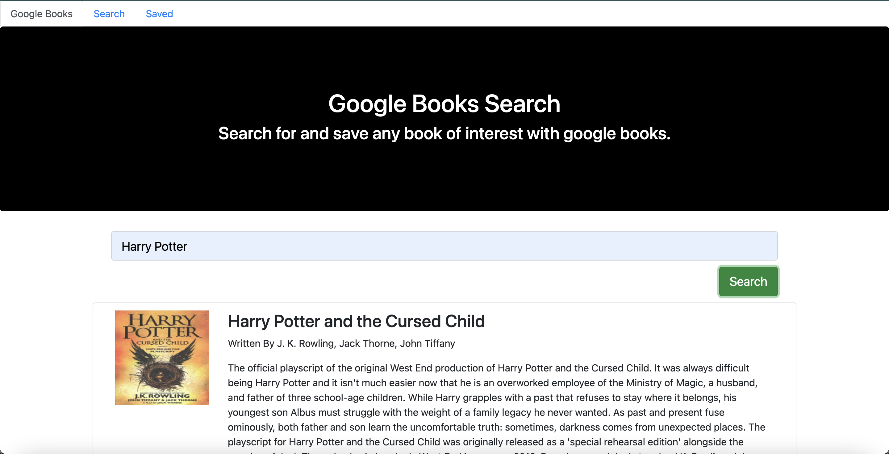

# Google Book Search App
  -Search for and save any book of your choice using Google Book's API.
  
  <h1>Technologies Used</h1>
  ReactJS, JavaScript, NodeJS, Express, Google Books API, Bootstrap, Mongoose, MongoDB, Path 

<h1>Instructions </h1>
    1.Clone the repository
    
    2.Run `npm install`
    
    3.Run `npm start`
    
    4.Visit localhost/3000 in the URL
   
    5.Click inside the search bar on site and search for any book of your choice
   
    6.View the results of your search, giving you the options of saving your book(s) and/or viewing the site to purchase them.
  
  
    
    

<h1>Building this Project</h1>
  
  
 This project involved connecting a front end design to a back-end server for overall book data management. In order to add or remove books from the saved list, controllers were created to convert these click requests into proper responses. Overall, this project took approximately a week for me to build. The process was challenging in the sense of making sure the database was properly receiving inputs from the front for book searches. But overall, I am happy with the results of this application. For future improvements, I plan to create a schema that will suggest similar books in addition to the one the user searched for based on genre and ratings.     
 

 

